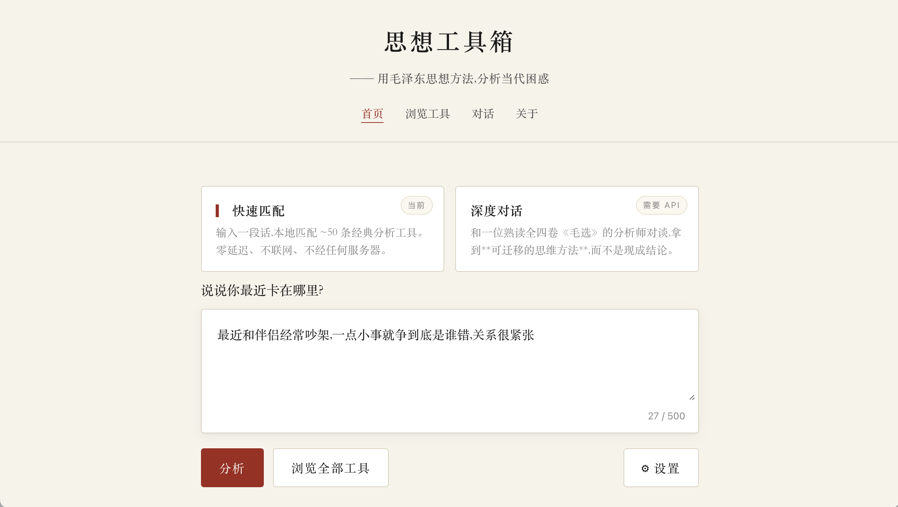
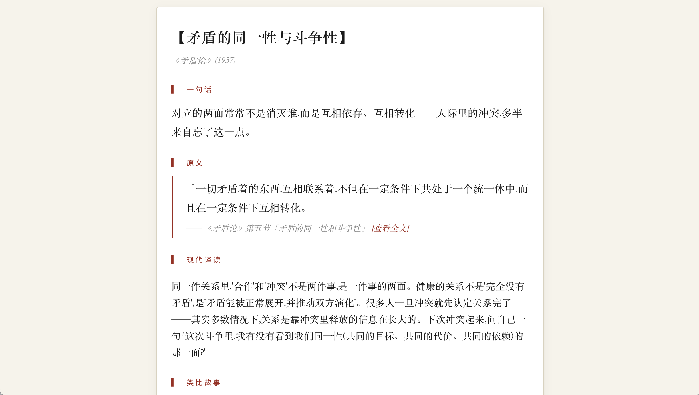
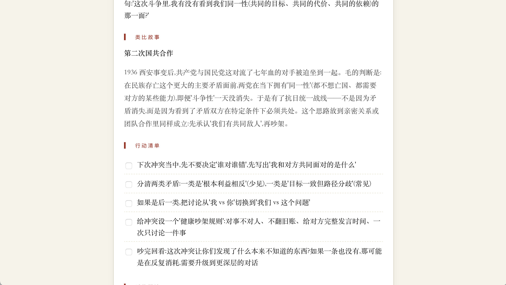
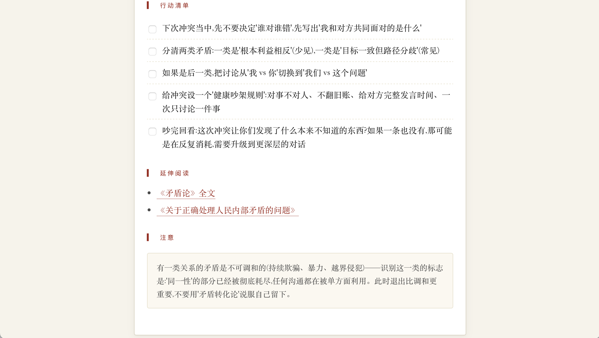

# 思想工具箱 · Thought Toolbox

把当代的困惑——工作里的选择、关系里的僵局、学习里的内耗——说给一套冷静的分析方法听。这是一个基于《毛泽东选集》四卷全集的 RAG 问答系统,不是政治宣传,也不是人生鸡汤;它所做的事,是用毛泽东本人在 1930-1940 年代处理复杂局面时用过的那套思维方法(主要矛盾、矛盾的特殊性、实践与认识、持久战、调查研究……),帮你把眼前的问题拆成你自己能继续分析下去的结构。

> 毛泽东思想里真正具有普适价值的,是一套分析问题的方法工具 —— 这个项目试图把这些工具从历史语境中抽出来,用来帮助当代人思考生活、工作、学习中的困惑。

---


---

## 它能做什么

**用具体困惑换一套可迁移的思维方法,而不是换一段语录。**

- **输入具体的处境**,比如:
  > "工作两年没进步,天天机械重复,想跳槽又不敢"

  系统会把这段话路由到《矛盾论》里「矛盾的特殊性」这一节,然后做**方法迁移**——先说明毛在 1937 年面对复杂矛盾时是怎么分析的(他先分解矛盾、再判断哪一个是决定性的),再把同一套分析动作平移到你的处境(列出你"没进步"背后至少四个不同性质的矛盾,每个解法不同),最后给 3-5 条**每条都能追溯到某一步分析逻辑**的行动建议。用户带走的是一套下次自己能用的思维模板,不是一段语录。

- **碰到分析方法论够不着的问题,会礼貌拒绝。**
  输入"我奶奶上周去世了,我一直没能见她最后一面,现在非常自责",系统不会套用毛选强行分析——它会简短共情、说明"这不是这个工具能帮上忙的地方"、建议找信任的人倾诉或专业心理咨询师。这是产品设计的一部分,不是 bug。同理拒绝:失恋、抑郁、急性心理危机、具体医疗/法律/投资建议、政治表态。

- **每段引用都溯源到 158 篇毛选四卷全集中的具体章节**,篇名 + 小节标题 + 指向 marxists.org 的原文链接。点击文中的《矛盾论》 会弹出引用段落的预览,再点一次打开完整原文。用户永远可以核对 AI 是不是在编话。

- **提供两条入口**。需要 API key 的**深度对话模式**(Claude 生成、158 篇全集检索)。另有一个**纯静态轻量模式**——不联网、不需要 key、基于一份手工整理的 ~50 条分析工具目录,做关键词匹配。适合懒得配环境或只想看看这是什么东西的访客。

---

## 截图 / Screenshots

以下四张截图展示**快速匹配模式**(不需要 API key 也能用)的完整用户流程。深度对话模式使用 SSE 流式聊天 UI,截图待补。

**1. 入口:写下你最近卡在哪里**



不需要注册、不需要选分类。打开就能用。首页顶部的双入口清晰区分「快速匹配(当前)」和「深度对话(需要 API)」,让不想配环境的访客也能立刻看到这个工具在做什么。

**2. 理论定位 + 可溯源的原文**



系统把用户的困惑路由到《矛盾论》里最贴切的一节——「矛盾的同一性与斗争性」——并给出严格不超过 80 个汉字的原文摘句,末尾附**[查看全文]**链接,直接跳转 marxists.org 原文。用户随时可以核对 AI 是不是在编话,这是本项目相对 fine-tune 方案的核心优势。

**3. 类比故事:方法本人在历史上是怎么用的**



不是抽象讲「要找同一性」,而是举出 1936 年西安事变之后、国共从你死我活变成共同抗日的真实案例——演示毛本人用同一套分析动作(识别主要敌人 / 承认暂时的共同目标)处理当时最激烈的内部冲突。方法的说服力来自**历史上它真的 work 过**,不是 AI 自圆其说。

**4. 行动清单 + 诚实的边界**



5 条可勾选的具体行动,每一条都对应上面分析里的某一步——比如「分清两类矛盾」对应「矛盾的特殊性」。底部的「注意」提醒用户:有些关系的矛盾是不可调和的(持续欺骗、暴力、越界),识别这一类时,退出比调和更重要——不要用「矛盾转化论」说服自己留下。**工具承认自己不是万能的**,这是设计哲学里「诚实的边界」在具体交互中的落地。

---

## 设计哲学

### 工具,不是结论

这个项目反复拒绝的一种设计,是"问一个问题,AI 给一个答案"。那样做用户每次都要依赖它;而我们的目标恰恰相反——**用户读完一次回答,下次遇到类似问题应该能自己用同样的方法想一遍,不必再打开这个工具**。

所以 agent 被反复指示:**拆解毛的分析逻辑 → 一比一平移到用户情境 → 每条行动建议都对应分析中的某一步**。如果某条行动凭空出现、对应不上任何一步推理,那就是在灌输结论,需要重写。

### 诚实的边界

Agent 被明确告知它**不适合处理**:情感创伤、亲密关系修复、存在主义焦虑、价值观冲突。遇到这些,它会说"这不是我能帮的事"并指向专业资源。

这听起来像在限制功能,实际上是在维护工具的可信度。一个号称能分析一切的 AI,用户很快就会发现它分析不了一切;一个在它不擅长的领域诚实说不会的工具,反而让人在它擅长的领域更信任它。

### 为什么不 fine-tune 一个"毛泽东 AI"

另一个反复被拒绝的方向,是"用毛选微调一个模型,让它用毛的口吻说话"。这样做有两个根本问题:

1. **不可溯源**。微调把文本揉进权重,用户看到一句"毛曾说过……"没法验证是原文、是改写、还是幻觉。本项目选择 RAG,每句引用都指向 marxists.org 某个具体 URL,可审计、可更新、可反驳。
2. **角色边界不清**。把一个历史人物的语言风格商品化,越过了合理使用的舒适区。Agent 始终以"熟读毛选的现代分析师"身份说话,不扮演毛泽东本人,不用第一人称。

---

## 技术栈

| 层 | 选型 |
|---|---|
| Frontend | 原生 HTML / CSS / JS,零框架零构建工具;SSE 流式渲染 |
| Backend | FastAPI + Python 3.12 + uvicorn,单进程同时服务 API 与静态站 |
| Retrieval | `BAAI/bge-small-zh-v1.5` 语义向量 + `rank_bm25` 关键词检索,RRF 融合,文章级多样性上限 |
| Query rewriting | Claude Haiku 4.5 把白话问题改写为毛选词汇(主要矛盾 / 实事求是 / 持久战 ……),提升检索命中 |
| Agent | Claude Sonnet 4.6,带 Step-0 适用性门控 + 方法迁移 prompt |
| Corpus | 《毛泽东选集》四卷 158 篇,切成 3,365 个 chunk,faiss `IndexFlatIP` 索引 |
| Ingest | 爬虫从 [marxists.org/chinese/maozedong](https://www.marxists.org/chinese/maozedong/) 下载全集,本地清洗、切块、向量化,全流程幂等可重建 |

一些有数字感的参考:检索质量在一份 10 条测试 query 的小集合上,端到端 hit@5 约 67%、MRR 约 0.46——**这不是正式 benchmark**,只是项目构建过程中用来对比不同检索策略的内部快照。你自己试的时候体验会因查询风格差异而有起伏。

---

## 快速开始

### (a) 最轻量:纯静态模式

无需任何安装,适合想 5 秒钟看一眼长什么样的访客。只能用关键词匹配那 ~50 条手工策划的词条,没有 AI 对话。

```bash
git clone https://github.com/YOUR_NAME/maoxuan-toolbox.git
cd maoxuan-toolbox
python3 -m http.server 8080
# 然后在浏览器打开 http://localhost:8080
```

### (b) 完整体验:深度对话模式

需要 Python 3.12 和 [Anthropic API key](https://console.anthropic.com/)。整个本地语料库会从 marxists.org 重新抓取一遍,大约 **3-5 分钟**,占磁盘空间 **约 30 MB**。

```bash
# 1. 克隆仓库
git clone https://github.com/YOUR_NAME/maoxuan-toolbox.git
cd maoxuan-toolbox

# 2. Python 环境
python3 -m venv .venv
source .venv/bin/activate
pip install -r backend/requirements.txt

# 3. 配置 API key
cp backend/.env.example backend/.env
# 编辑 backend/.env,填入 ANTHROPIC_API_KEY=sk-ant-...

# 4. 构建本地语料库(一次性,幂等可恢复)
bash setup.sh

# 5. 启动统一服务
uvicorn backend.main:app --port 8000

# 6. 浏览器打开
open http://localhost:8000/chat.html
```

`setup.sh` 分步执行爬取 → 清洗 → 切块 → 向量化,每一步失败可从断点继续。首次运行还会下载 `bge-small-zh-v1.5` 模型到 Hugging Face 缓存(~100MB,永久缓存,后续运行跳过)。

第一次运行 `backend.main` 时,`/chat` 端点需要 ANTHROPIC_API_KEY 才能工作;其他端点(`/articles`、`/article/{id}`、`/chunk/{id}`)不需要 key 也能用。

### (c) 临时分享:ngrok 隧道模式

想给朋友试用但又不想让他们配环境,可以用 [ngrok](https://ngrok.com/) 把本地服务临时暴露到公网。

```bash
# 一个终端跑服务
uvicorn backend.main:app --port 8000

# 另一个终端开隧道
ngrok http 8000

# ngrok 会给出一个 https://xxxx.ngrok-free.app 地址,直接把
# https://xxxx.ngrok-free.app/chat.html 发给朋友就行
```

⚠️ **API 费用由发起人承担**,别把链接挂到公开频道。项目内置了两层最低限度的保护:CORS 只放行 `*.ngrok-free.app` 与 `*.ngrok.app`;`/chat` 端点有每 IP 每 10 分钟 10 次的软速率限制(超限返回 429)。**这不是生产级防护**,只是防止一个不小心连续刷爆你的 API 额度。分享结束记得 `Ctrl+C` 关掉 ngrok,老链接立刻失效。

---

## 已知的环境坑

- **macOS Intel (x86_64)**:PyTorch 在 2.3 之后停止支持 Intel Mac。`requirements.txt` 里 `torch>=2.2,<2.6` 会在此平台自动解析到 2.2.x。无需手动调整,但如果报错请先检查 `uname -m`。
- **NumPy 必须 <2**。PyTorch 2.2.x 的 wheel 是按 NumPy 1.x ABI 编译的,NumPy 2.x 会触发 `_ARRAY_API not found`。`requirements.txt` 已固定 `numpy<2`,但如果你之前手动装了 numpy 2.x,跑 `pip install "numpy<2"` 降级一下。
- **中国大陆网络**:`setup.sh` 会访问 `marxists.org`(下载毛选全集)和 `huggingface.co`(下载 embedding 模型);运行时需要访问 `api.anthropic.com`(Claude 推理)。三者都可能需要稳定的国际连接。Hugging Face 可以通过镜像加速(搜索 `hf-mirror`),其他两个目前没有国内镜像。
- **首次构建耗时**:`setup.sh` 约 3-5 分钟(主要是按礼貌节奏爬取 marxists.org——每篇间隔 1.5-3 秒)。embedding 约 1 分钟(bge-small-zh 非常轻量)。不需要 GPU。

---

## 项目结构

```
.
├── index.html                    # v1 静态站:关键词匹配入口
├── chat.html                     # v3 深度对话页面(SSE 流式)
├── browse.html, about.html       # 浏览所有工具 / 项目说明
├── styles.css                    # 全站样式(米白 / 墨黑 / 朱红,书卷气)
├── js/
│   ├── main.js, matcher.js       # v1 关键词匹配逻辑
│   ├── renderer.js, ai-mode.js   # v1 渲染 / 可选 AI 模式
│   └── chat.js                   # v3 聊天前端(SSE 消费、引用弹层、原文 modal)
├── data/
│   ├── entries.json              # v1 的 ~50 条手工思想工具词条
│   └── schema.md                 # 词条数据结构说明
├── backend/
│   ├── main.py                   # FastAPI 入口:/chat /articles /article/{id} /chunk/{id}
│   ├── agent.py                  # Sonnet agent · locked SYSTEM_PROMPT(方法迁移 + Step-0 门控)
│   ├── rag.py                    # 检索层:dense / BM25 / hybrid / rewrite / rerank
│   ├── requirements.txt          # 依赖 pin
│   ├── .env.example              # 环境变量模板(ANTHROPIC_API_KEY 等)
│   └── ingest/
│       ├── crawler.py            # marxists.org 爬取器(礼貌节奏、断点续传)
│       ├── parser.py             # HTML → markdown 清洗(A+B trim 规则)
│       ├── chunker.py            # 结构感知切块(按 ## 节切、footnote 独立)
│       ├── embedder.py           # bge 向量化 + faiss 索引构建
│       ├── manifest.py           # 篇目 manifest 读写
│       ├── eval_retrieval.py     # 10-query 检索评测 harness
│       └── run.py                # 端到端流水线一键入口
├── manifest/
│   ├── maoxuan-index.json        # 158 篇元数据(篇名 / 章节 / 年月 / 卷 / URL)
│   └── upstream_extras.json      # 10 篇 marxists.org 有但未收入选集的候选
├── corpus/                       # 运行时生成,大部分 gitignored
│   ├── raw/vol{1..4}/            #   每篇一个 .md(抓取后清洗)
│   ├── chunks.jsonl              #   3365 个切块记录
│   ├── chunk_id_map.json         #   chunk_id → faiss 行号映射
│   ├── index.faiss               #   3365 × 512 向量索引
│   ├── rewrite_cache.json        #   Haiku 改写缓存(committable)
│   └── stories/                  #   类比故事目录(待收录)
├── docs/
│   └── rerank-experiment.md      # Layer-4 LLM rerank 的失败记录与后续方案
├── setup.sh                      # 一键构建语料库
├── CONTRIBUTING.md               # (当前仍是 v1 贡献说明,待更新)
└── LICENSE                       # MIT
```

---

## 这个项目不是什么

- **不是政治立场输出工具**。agent 被明确禁止就具体政治人物、政策、事件发表评价。项目只处理方法论层面。
- **不是心理/法律/医疗咨询替代品**。遇到这些需求会礼貌拒绝并建议寻求专业帮助。
- **不是 fine-tuned 的"毛泽东 AI"**。没有角色扮演,不用第一人称,不模仿毛的语气。引用毛选原文时始终加书名号 + 出处链接,让文本和 AI 自己的话清晰可辨。
- **不是应试 / 考研 / 政治考试辅导工具**。不提供标准答案,不适合应试场景。

---

## 致谢

- **[马克思主义文库 marxists.org](https://www.marxists.org/chinese/maozedong/)** · 为本项目提供的毛选四卷数字化全文,是整个检索系统的基础。没有这份多年维护的、结构一致的、公开可访问的文本,这个项目不可能用一个下午就把 158 篇全集跑起来。
- **[北京智源人工智能研究院 BAAI](https://github.com/FlagOpen/FlagEmbedding)** · 开源的 `bge-small-zh-v1.5` 中文 embedding 模型。23M 参数、512 维、对古典 + 白话中文都有体面的语义对齐能力。
- **[Anthropic](https://www.anthropic.com/)** · Claude Sonnet / Haiku 模型的推理能力,以及 [Claude Code](https://claude.com/claude-code) 作为这整个项目开发过程中的 pair-programmer。
- **开源基础设施**:`faiss`(检索)、`sentence-transformers`(嵌入)、`rank_bm25`(词项匹配)、`jieba`(中文分词)、`FastAPI` + `uvicorn`(服务端)、`markdownify` + `BeautifulSoup`(清洗)。这些是现代 AI 应用的水电煤,感谢每一位维护者。

---

> **关于本项目的来历**——这是一次 AI 辅助编程的实验。从一个下午冒出来的 idea("能不能把毛选做成个 RAG"),到可部署的 158 篇全集深度对话系统,大约 20 轮对话完成。如果你想看看真实的开发过程——每一步的决策、失败、重试——commit history 是清晰的,`docs/rerank-experiment.md` 是一个典型样本(一次失败实验的完整剖析)。

---

## 贡献

欢迎 PR——具体方向有两个:

- **新增故事案例**到 `corpus/stories/`(v3 agent 会用这些打类比,目前是空的,急需人工整理)。
- **改进 agent prompt 或检索策略**——如果你自己跑了一轮,发现某类查询效果不佳,欢迎开 issue 讨论。

详见 [`CONTRIBUTING.md`](CONTRIBUTING.md)。(*注:现有的 CONTRIBUTING.md 仍是 v1 时期为静态词条贡献写的,v3 版本的贡献流程待更新。*)

---

## License

MIT — 见 [`LICENSE`](LICENSE)。欢迎 fork 做你自己的思想工具箱(阳明心学版、斯多葛版、佛学版、荀子版……这是个好模板)。

---

## 免责声明

> 本项目是一个学习和思考辅助工具,目的是提取《毛泽东选集》中具有普适性的**分析方法**(矛盾分析、实事求是、实践与认识的关系等),帮助读者思考当代个人困惑。
>
> 项目**不提供政治立场**、**不替代专业心理/法律/医疗建议**。所引用的毛选原文版权归相应权利人所有,本项目遵循学术合理使用原则——每段引文不超过 80 个汉字,均附明确出处 + 原文链接,鼓励读者阅读完整原著。
>
> AI 生成的内容可能出错、过时、或有偏差。涉及重要决策的事项,请结合专业建议与个人判断。
